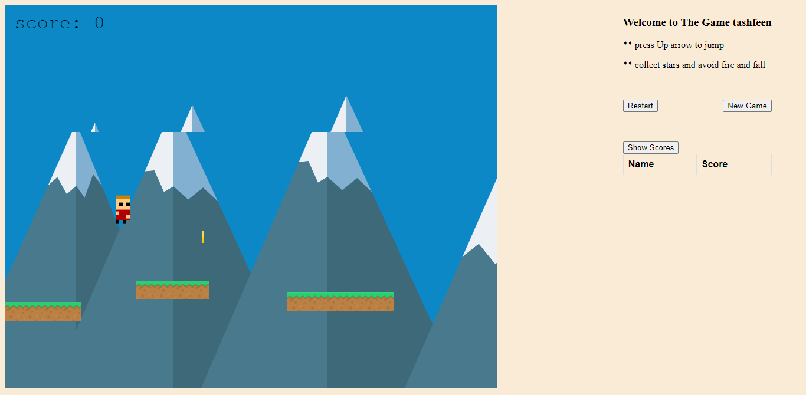
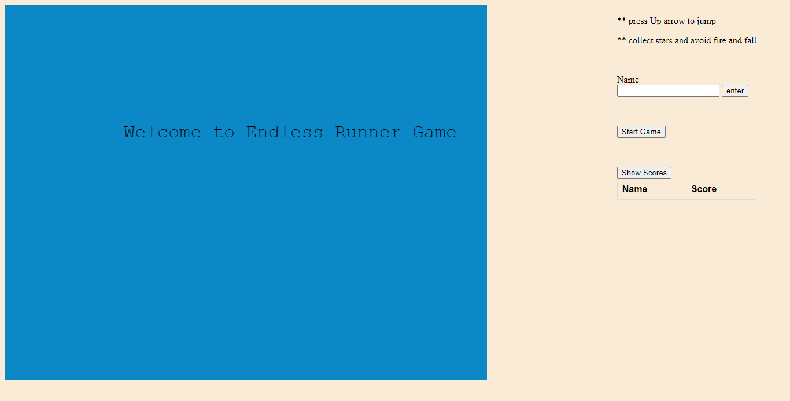

<h1 align="center">
   
    Endless Runner
   
</h1>

<h4 align="center">This project is a platform game built using a phaser web gaming framework and pure javascript. An endless game in which a player will run on never end platform. The goal is to collect as many stars as possible for increasing scores. The Player has to avoid fire and does not fall below the platform. User score stored on external API.
</h4>
 

 

### Built With

This project was Phaser-3.js, a 2D game framework for making HTML5 games for desktop and mobile.

## Prerequisites

- Git
- Node.js
- NPM
- Webpack
- Jest

## Live Version

- You can view the app hosted online [here](https://endlessrunner.netlify.app/).

### Game Scene

### How To Play

- Up arrow jump the Player
- Down arrow fall the Player
- Collect Stars and increase your score
- avoid fall and fire.

## Playing Locally

Copy the following instructions sequentially into your terminal

- git clone https://github.com/tashfeenrao/endlessRunner.git

- cd endlessRunner

- Run `npm install`

- Run **_npm run start-dev_** in your terminal to fire the Webpack server

- Visit http://localhost:8080 on your browser.

## TestingJavascript-Capstone

- cd endlessRunner

- Run `npm install`

- Run `npm run test`to run the test suites

<!-- FUTURE IMPROVEMENTS -->

## Future Improvements

See the [open issues](https://github.com/tashfeenrao/endlessRunner/issues) for a list of proposed features (and known issues).

<!-- LICENSE -->

## License

MIT

<!-- CONTACT -->

## Author
---
[Tashfeen Rao](https://tashfeenrao.github.io/personal-portfolio/) &nbsp;&middot;&nbsp;
 
Email: tashfeendev@gmail.com &nbsp;&middot;&nbsp;
 
AngelList [TashfeenRao](https://angel.co/u/tashfeen-rao) &nbsp;&middot;&nbsp;
 
LinkedIn [Tashfeen Rao](https://www.linkedin.com/in/tashfeen-rao/) &nbsp;&middot;&nbsp;
 
Twitter [@TashfeenDev](https://twitter.com/TashfeenDev) &nbsp;&middot;&nbsp;
